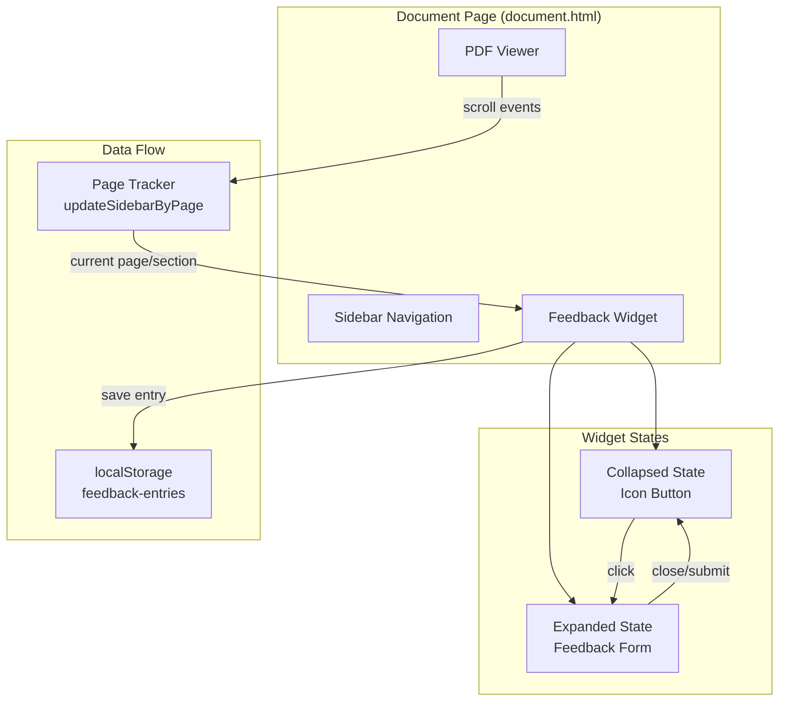
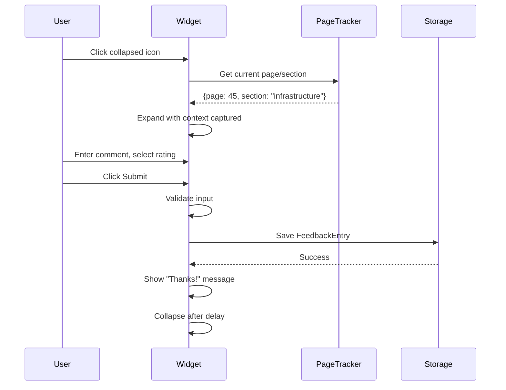

# Design Document: Document Feedback Widget

## Overview

The Document Feedback Widget is a floating UI component for the document viewer page (document.html) that enables users to submit contextual feedback about the Ghana EdTech Strategy PDF without navigating away. The widget toggles between a collapsed icon state and an expanded form state, automatically captures the current page/section context, and stores feedback in localStorage for future backend integration.

### Key Design Decisions

1. **Vanilla JavaScript Implementation**: No framework dependencies to match existing codebase patterns
2. **CSS-in-HTML Approach**: Widget styles embedded in document.html consistent with existing page structure
3. **localStorage for Persistence**: Simple key-value storage with JSON serialization for feedback entries
4. **Integration with Existing Page Tracking**: Leverage `sectionPageMap` and page detection logic already present

## Architecture



### Component Interaction Flow



## Components and Interfaces

### 1. FeedbackWidget Class

The main controller class managing widget state and interactions.

```javascript
class FeedbackWidget {
  constructor(options) {
    this.storageKey = options.storageKey || 'edtech-feedback-entries';
    this.isExpanded = false;
    this.capturedContext = null;
    this.elements = {};
  }
  
  // Initialize widget and attach to DOM
  init() { }
  
  // Toggle between collapsed and expanded states
  toggle() { }
  
  // Expand widget and capture current context
  expand() { }
  
  // Collapse widget to icon state
  collapse() { }
  
  // Capture current page and section from PDF viewer
  captureContext() { }
  
  // Validate and submit feedback
  submit() { }
  
  // Store feedback entry in localStorage
  saveToStorage(entry) { }
  
  // Retrieve all stored feedback entries
  getStoredFeedback() { }
  
  // Show confirmation message
  showConfirmation() { }
  
  // Show error message
  showError(message) { }
  
  // Clean up event listeners
  destroy() { }
}
```

### 2. FeedbackEntry Interface

Data structure for storing feedback submissions.

```typescript
interface FeedbackEntry {
  id: string;           // Unique identifier (UUID or timestamp-based)
  device_id: string;    // Persistent device identifier for backend
  comment: string;      // User's feedback text (maps to 'feedback' in API)
  rating: string | null; // Optional satisfaction rating
  pageNumber: number;   // PDF page when feedback was initiated
  sectionId: string;    // Section ID from sectionPageMap
  timestamp: string;    // ISO 8601 timestamp
  synced: boolean;      // Whether successfully sent to backend
}
```

### 3. Backend API Integration

The widget integrates with the EduDoc API for persistent storage:

```javascript
// API endpoint
const API_BASE_URL = 'http://localhost:5000'; // Configure for production
const FEEDBACK_ENDPOINT = '/api/feedback/submit';

// Submit to backend
async function submitToBackend(entry) {
  const response = await fetch(`${API_BASE_URL}${FEEDBACK_ENDPOINT}`, {
    method: 'POST',
    headers: {
      'Content-Type': 'application/json',
    },
    body: JSON.stringify({
      device_id: entry.device_id,
      feedback: entry.comment,
      rating: mapRatingToBackend(entry.rating), // Convert to backend format
    }),
  });
  
  if (!response.ok) {
    throw new Error(`API error: ${response.status}`);
  }
  
  return response.json();
}

// Map frontend rating values to backend enum
function mapRatingToBackend(rating) {
  const mapping = {
    'very_satisfied': 'very satisfied',
    'satisfied': 'satisfied',
    'neutral': 'neutral',
    'dissatisfied': 'dissatisfied',
    'very_dissatisfied': 'very dissatisfied',
  };
  return mapping[rating] || 'neutral';
}

// Generate or retrieve persistent device ID
function getDeviceId() {
  const DEVICE_ID_KEY = 'edtech-device-id';
  let deviceId = localStorage.getItem(DEVICE_ID_KEY);
  if (!deviceId) {
    deviceId = 'device_' + Date.now() + '_' + Math.random().toString(36).substring(2, 10);
    localStorage.setItem(DEVICE_ID_KEY, deviceId);
  }
  return deviceId;
}
```

### 4. Widget HTML Structure

```html
<div id="feedback-widget" class="feedback-widget" aria-label="Feedback widget">
  <!-- Collapsed State: Icon Button -->
  <button 
    id="feedback-toggle" 
    class="feedback-toggle"
    aria-label="Open feedback form"
    aria-expanded="false"
    aria-controls="feedback-panel"
  >
    <svg><!-- Feedback icon --></svg>
  </button>
  
  <!-- Expanded State: Form Panel -->
  <div 
    id="feedback-panel" 
    class="feedback-panel"
    role="dialog"
    aria-labelledby="feedback-title"
    aria-hidden="true"
  >
    <div class="feedback-header">
      <h3 id="feedback-title">Share Feedback</h3>
      <button class="feedback-close" aria-label="Close feedback form">×</button>
    </div>
    
    <form id="feedback-form" class="feedback-form">
      <div class="feedback-context" aria-live="polite">
        <!-- Shows current page/section context -->
      </div>
      
      <label for="feedback-comment">Your feedback</label>
      <textarea 
        id="feedback-comment" 
        placeholder="What do you think about this section?"
        required
      ></textarea>
      
      <label for="feedback-rating">Satisfaction (optional)</label>
      <select id="feedback-rating">
        <option value="">-- Select --</option>
        <option value="very_satisfied">Very Satisfied</option>
        <option value="satisfied">Satisfied</option>
        <option value="neutral">Neutral</option>
        <option value="dissatisfied">Dissatisfied</option>
        <option value="very_dissatisfied">Very Dissatisfied</option>
      </select>
      
      <button type="submit" class="feedback-submit">Send Feedback</button>
    </form>
    
    <!-- Confirmation/Error Messages -->
    <div id="feedback-status" class="feedback-status" aria-live="assertive"></div>
  </div>
</div>
```

### 5. Context Capture Integration

Integration with existing page tracking in document.html:

```javascript
// Existing in document.html - we'll hook into this
function updateSidebarByPage(pageNum) {
  // ... existing logic ...
}

// New: Get current context for feedback widget
function getCurrentDocumentContext() {
  // Find current page from scroll position
  let currentPage = 1;
  const scrollTop = viewerWrap.scrollTop;
  
  for (let i = 1; i <= pdfDoc.numPages; i++) {
    const canvas = pageCanvases[i];
    if (canvas && scrollTop + viewerWrap.clientHeight * 0.25 >= canvas.offsetTop) {
      currentPage = i;
    }
  }
  
  // Map page to section
  let currentSection = null;
  const pageArray = Object.entries(sectionPageMap).sort((a, b) => a[1] - b[1]);
  for (let i = pageArray.length - 1; i >= 0; i--) {
    if (currentPage >= pageArray[i][1]) {
      currentSection = pageArray[i][0];
      break;
    }
  }
  
  return {
    pageNumber: currentPage,
    sectionId: currentSection,
    sectionName: getSectionDisplayName(currentSection)
  };
}
```

## Data Models

### FeedbackEntry Storage Schema

```javascript
// localStorage key: 'edtech-feedback-entries'
// Value: JSON array of FeedbackEntry objects

const feedbackEntrySchema = {
  id: "string",           // Format: "fb_" + timestamp + "_" + random
  device_id: "string",    // Persistent device identifier
  comment: "string",      // Required, non-empty, trimmed
  rating: "string|null",  // One of: very_satisfied, satisfied, neutral, dissatisfied, very_dissatisfied
  pageNumber: "number",   // Integer >= 1
  sectionId: "string",    // Key from sectionPageMap or "unknown"
  timestamp: "string",    // ISO 8601 format
  synced: "boolean"       // Whether sent to backend successfully
};

// Example stored data:
[
  {
    "id": "fb_1704067200000_a1b2c3",
    "device_id": "device_1704000000000_x7y8z9",
    "comment": "The infrastructure section could use more specific timelines.",
    "rating": "satisfied",
    "pageNumber": 34,
    "sectionId": "infrastructure",
    "timestamp": "2025-01-01T12:00:00.000Z",
    "synced": true
  }
]
```

### Device ID Storage

```javascript
// localStorage key: 'edtech-device-id'
// Value: string - persistent device identifier

// Generated once per browser/device, persists across sessions
// Format: "device_" + timestamp + "_" + random
```

### ID Generation

```javascript
function generateFeedbackId() {
  const timestamp = Date.now();
  const random = Math.random().toString(36).substring(2, 8);
  return `fb_${timestamp}_${random}`;
}
```

### Storage Operations

```javascript
const FeedbackStorage = {
  STORAGE_KEY: 'edtech-feedback-entries',
  
  // Get all entries
  getAll() {
    try {
      const data = localStorage.getItem(this.STORAGE_KEY);
      return data ? JSON.parse(data) : [];
    } catch (e) {
      console.error('Failed to read feedback storage:', e);
      return [];
    }
  },
  
  // Add new entry
  add(entry) {
    const entries = this.getAll();
    entries.push(entry);
    localStorage.setItem(this.STORAGE_KEY, JSON.stringify(entries));
    return entry;
  },
  
  // Check if storage is available
  isAvailable() {
    try {
      const test = '__storage_test__';
      localStorage.setItem(test, test);
      localStorage.removeItem(test);
      return true;
    } catch (e) {
      return false;
    }
  }
};
```


## Correctness Properties

*A property is a characteristic or behavior that should hold true across all valid executions of a system—essentially, a formal statement about what the system should do. Properties serve as the bridge between human-readable specifications and machine-verifiable correctness guarantees.*

### Property 1: Widget State Toggle

*For any* widget in collapsed state, clicking the toggle button should result in the widget being in expanded state with the form visible. Conversely, *for any* widget in expanded state, pressing the Escape key should result in the widget being in collapsed state.

**Validates: Requirements 2.1, 2.5**

### Property 2: Feedback Submission Creates Complete Entry

*For any* valid (non-empty, non-whitespace) comment and any current page/section context, submitting feedback should result in a FeedbackEntry being stored in localStorage that contains: the exact comment text, the optional rating value, the captured page number, the captured section ID, a valid ISO timestamp, and a unique ID.

**Validates: Requirements 4.3, 4.4, 5.1, 5.2, 5.3**

### Property 3: Section Derivation from Page Number

*For any* page number within the valid PDF range, the section derivation function should return the correct section ID according to the sectionPageMap—specifically, the section whose starting page is the highest value that is less than or equal to the given page number.

**Validates: Requirements 4.2**

### Property 4: Unique ID Generation

*For any* set of generated feedback IDs (even when generated in rapid succession), all IDs in the set should be unique—no two IDs should be equal.

**Validates: Requirements 5.4**

### Property 5: Empty Comment Rejection

*For any* string that is empty or consists entirely of whitespace characters, attempting to submit feedback should be rejected and no FeedbackEntry should be created or stored.

**Validates: Requirements 5.6**

### Property 6: Form Clearing After Submission

*For any* successful feedback submission, the textarea and rating select should be reset to their initial empty states.

**Validates: Requirements 6.4**

### Property 7: Accessibility - Interactive Elements

*For any* interactive element within the widget (buttons, inputs, select), the element should be focusable via keyboard (tabindex >= 0 or naturally focusable), have an associated label or aria-label, and have dimensions of at least 44x44 pixels for touch accessibility.

**Validates: Requirements 7.3, 8.1, 8.5**

### Property 8: Focus Trap in Expanded State

*For any* expanded widget state, tabbing through focusable elements should cycle within the widget boundaries—focus should not escape to elements outside the widget panel until the widget is collapsed.

**Validates: Requirements 8.3**

### Property 9: Storage Round-Trip

*For any* FeedbackEntry that is saved to localStorage, retrieving all entries from localStorage should include that entry with all fields intact and equal to the original values.

**Validates: Requirements 5.3**

## Error Handling

### Storage Unavailable

When localStorage is unavailable (private browsing, storage quota exceeded, or disabled):

```javascript
function handleStorageError() {
  // Check storage availability before submission
  if (!FeedbackStorage.isAvailable()) {
    showError('Unable to save feedback. Please check your browser settings.');
    return false;
  }
  return true;
}
```

### Invalid Input

```javascript
function validateFeedback(comment) {
  const trimmed = comment.trim();
  if (!trimmed) {
    showError('Please enter your feedback before submitting.');
    return { valid: false, error: 'empty_comment' };
  }
  if (trimmed.length > 5000) {
    showError('Feedback is too long. Please keep it under 5000 characters.');
    return { valid: false, error: 'too_long' };
  }
  return { valid: true, value: trimmed };
}
```

### PDF Context Unavailable

When the PDF hasn't loaded or page tracking fails:

```javascript
function captureContextSafely() {
  try {
    if (!pdfDoc || !pageCanvases || Object.keys(pageCanvases).length === 0) {
      return { pageNumber: 0, sectionId: 'unknown', sectionName: 'Document' };
    }
    return getCurrentDocumentContext();
  } catch (e) {
    console.error('Failed to capture context:', e);
    return { pageNumber: 0, sectionId: 'unknown', sectionName: 'Document' };
  }
}
```

### Error Display

```javascript
function showError(message) {
  const statusEl = document.getElementById('feedback-status');
  statusEl.textContent = message;
  statusEl.className = 'feedback-status feedback-error';
  statusEl.setAttribute('role', 'alert');
  
  // Clear error after 5 seconds
  setTimeout(() => {
    statusEl.textContent = '';
    statusEl.className = 'feedback-status';
  }, 5000);
}
```

## Testing Strategy

### Unit Tests

Unit tests should cover specific examples and edge cases:

1. **DOM Structure Tests**
   - Verify widget contains required elements (toggle button, form, textarea, select, submit button)
   - Verify no personal information fields exist (no email, name inputs)
   - Verify aria attributes are present

2. **Edge Case Tests**
   - Empty string submission rejection
   - Whitespace-only submission rejection
   - Very long comment handling (5000+ characters)
   - localStorage unavailable scenario
   - PDF not loaded scenario (context capture fallback)

3. **State Transition Tests**
   - Initial state is collapsed
   - Click outside expanded widget does not collapse it
   - Confirmation message appears after successful submission
   - Widget collapses after confirmation timeout

### Property-Based Tests

Property-based tests should use a library like **fast-check** for JavaScript to verify universal properties across many generated inputs.

**Configuration:**
- Minimum 100 iterations per property test
- Each test tagged with: **Feature: document-feedback-widget, Property {N}: {property_text}**

**Property Test Implementations:**

1. **Property 1: State Toggle**
   - Generate random sequences of toggle/escape actions
   - Verify state consistency after each action

2. **Property 2: Submission Creates Complete Entry**
   - Generate random valid comments (non-empty strings)
   - Generate random ratings (including null)
   - Generate random page numbers and sections
   - Verify all fields present in stored entry

3. **Property 3: Section Derivation**
   - Generate random page numbers within PDF range
   - Verify section matches expected from sectionPageMap

4. **Property 4: Unique ID Generation**
   - Generate batches of IDs (100+ at a time)
   - Verify no duplicates in any batch

5. **Property 5: Empty Comment Rejection**
   - Generate strings of only whitespace (spaces, tabs, newlines)
   - Verify submission is rejected for all

6. **Property 6: Form Clearing**
   - Generate random valid submissions
   - Verify form fields are empty after each

7. **Property 7: Accessibility**
   - Query all interactive elements
   - Verify each meets accessibility criteria

8. **Property 8: Focus Trap**
   - Simulate tab key presses in expanded state
   - Verify focus cycles within widget

9. **Property 9: Storage Round-Trip**
   - Generate random FeedbackEntry objects
   - Save and retrieve, verify equality

### Test File Structure

```
tests/
  feedback-widget/
    widget.unit.test.js      # Unit tests for DOM and edge cases
    widget.property.test.js  # Property-based tests
    storage.test.js          # localStorage operations tests
    context.test.js          # Page/section context capture tests
```

### Testing Tools

- **Test Runner**: Vitest (compatible with existing project if any, or Jest)
- **Property Testing**: fast-check
- **DOM Testing**: jsdom or happy-dom
- **Assertions**: Vitest built-in or Chai
